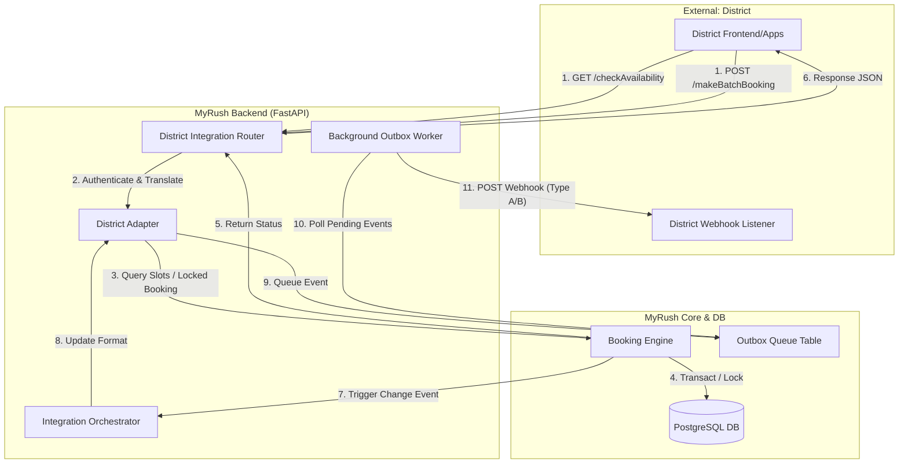

# MyRush x District: Architecture & Flow Design

This document describes the high-level architecture and the data flow of the MyRush-District integration.

## 1. Visual Architecture Flow

The following diagram illustrates how an external request from District is processed and how MyRush proactively updates District about changes.

---

## 2. The Booking Lifecycle (Step-by-Step)

To explain "how it works" to the District team, follow this lifecycle:

1.  **Request Arrival**: District sends a batch booking request to our dedicated integration endpoint.
2.  **Authentication**: The system validates the `unique-id` and `apiKey`.
3.  **Adapter Translation**: Our `DistrictAdapter` maps the District slot numbers (e.g., Slot 20) to our internal 30-minute time resolution (e.g., 10:00 AM).
4.  **Inventory Locking**: To prevent double bookings, the system places a **Pessimistic Lock** on the database rows for those specific courts. No other user (even on our own app) can grab those slots until the transaction finishes.
5.  **Persistence**: The booking is recorded as `confirmed` and `paid`. 
6.  **Outbox Queueing**: Instead of making District wait while we notify our other systems, we write a "Notification Task" into our **Integration Outbox**.
7.  **Background Delivery**: Within seconds, a separate **Outbox Worker** picks up the task and pushes a Type B webhook back to District to confirm the inventory is now blocked.

---

## 3. The Core Architecture Pillars

- **Adapter Pattern**: Decouples District's logic from MyRush. If District changes their API, only the Adapter needs an update.
- **30-Minute Engine**: A recently overhauled slot engine that provides granular 0.5-hour resolution for all booking channels.
- **Idempotency**: Prevents duplicate bookings by hashing every request; retried requests get the original success response instead of a new charge.
- **Auditability**: Every inbound and outbound byte is captured in `integration_logs` for troubleshooting.

---
**Status**: 100% Implemented & Scalable.
**Architecture Class**: Enterprise Grade.
