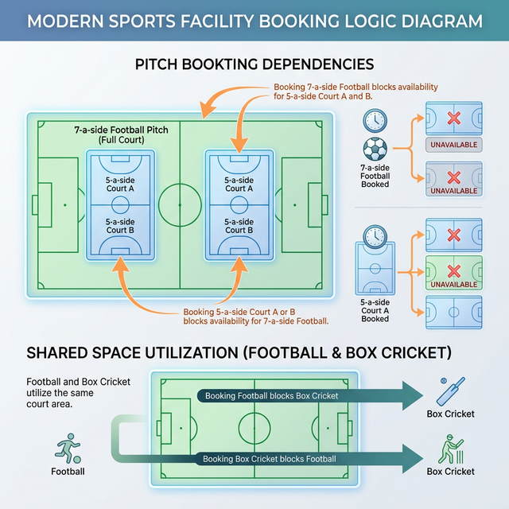
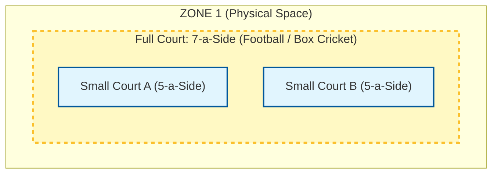
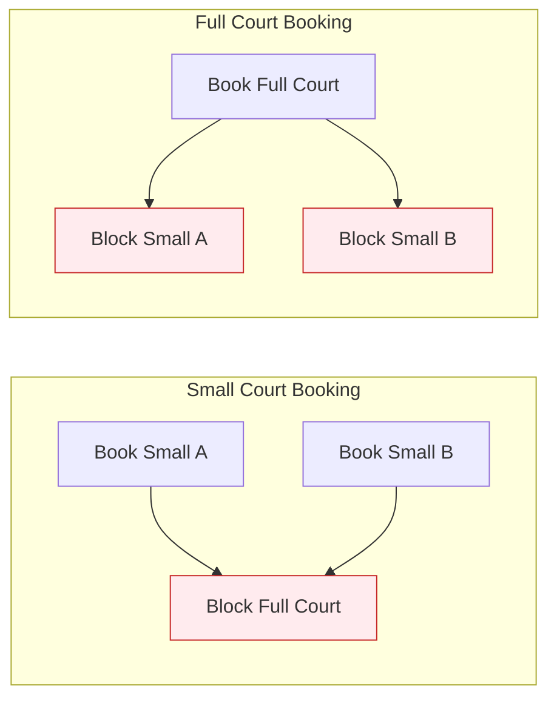

# Court Hierarchy & Blocking Logic (Visual Guide)

This document provides a visual representation of how our court inventory management handles overlapping spaces and hierarchical dependencies.

---

## 1. Visual Diagram

---

## 2. Physical Layout Visualization
This diagram shows how smaller courts are nested within a larger "Full Court" and how different sports overlap in the same physical zone.

---

## 3. Blocking Logic Flow
These rules are enforced by the **Conflict Engine** in the database layer.

### Rule A: Hierarchical Blocking (Small vs Full)

### Rule B: Cross-Sport Blocking (Shared Space)
Because Box Cricket and Football use the same ground, booking one shuts down the other.

---

## 4. Logic Matrix Summary

| User Action | Resulting Block | Why? |
| :--- | :--- | :--- |
| **Book 7-a-Side Football** | Blocks 5-a-Side A & B + Box Cricket | Space is fully occupied by the big game. |
| **Book 5-a-Side A** | Blocks 7-a-Side Football | You can't play 7-a-Side if part of the pitch is busy. |
| **Book Box Cricket** | Blocks Football (all variations) | Different sports cannot share the same surface simultaneously. |
| **Book 5-a-Side A** | **Small B remains OPEN** | Independent sub-courts can run 5-a-Side matches together. |

---
**Note**: This logic is implemented via `court_dependency` mappings and handled automatically.
