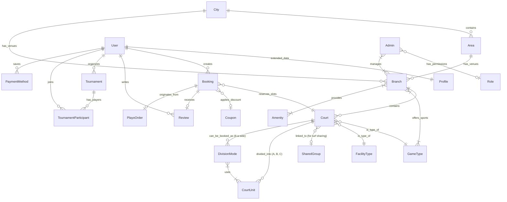
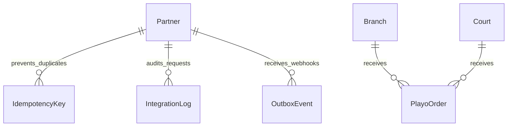
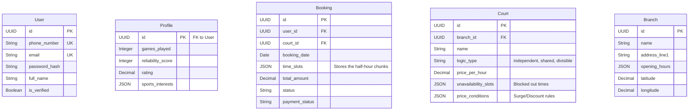
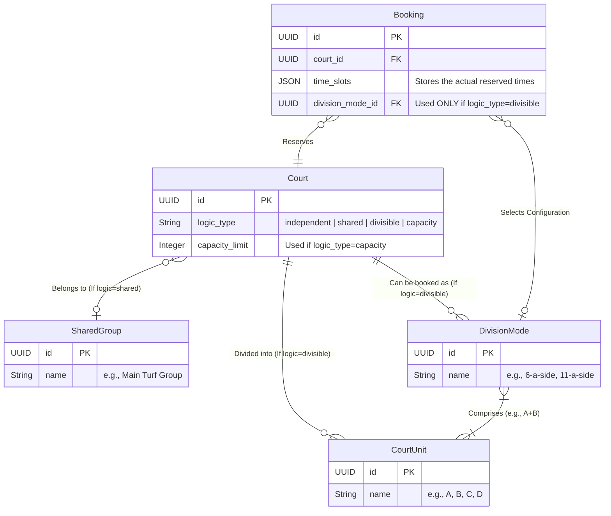

# Myrush Database Entity-Relationship Diagram (ERD)

This document provides a visual representation of the core data model and how the tables interact.

## Core Hierarchy & Booking Flow

## Partner Integrations & Extensions

## Attribute Definitions (Key Tables)

## 4. Court Sharing & Overlaps Architecture

