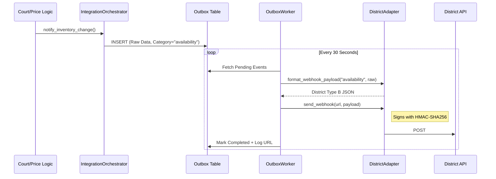
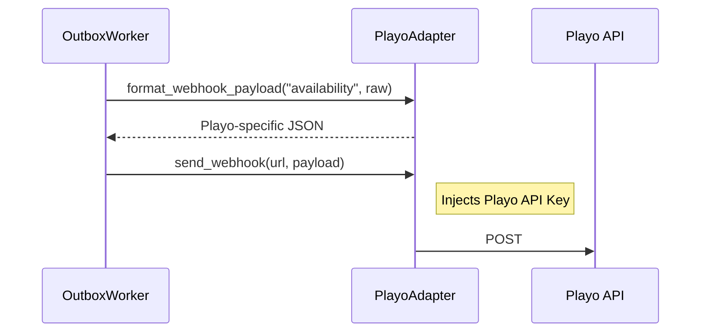

# Technical Guide: Pluggable Multi-Vendor Webhook System

This guide explains the architecture, operation, and extension of the MyRush Webhook Engine. This system is built using the **Adapter Pattern** to ensure that multi-vendor integrations (District, Playo, Hudle, etc.) can be managed without modifying core backend code.

---

## 1. System Overview: The Three Pillars

The architecture is divided into three layers to isolate vendor-specific logic from internal business rules.

### **Pillar 1: The Durable Outbox (Reliability)**
Instead of making immediate HTTP calls, MyRush logic (bookings, pricing changes) queues events in the `integration_outbox_events` table.
- **Raw Data Strategy**: We store internal IDs and raw values (e.g., `court_id`, `new_price`).
- **Delayed Translation**: Formatting into vendor-specific JSON is delayed until the exact moment of transmission. This ensures that if a vendor updates their API, our existing queue doesn't break.

### **Pillar 2: The Adapter Layer (Translation & Protocol)**
Each vendor has a dedicated **Adapter** class (inheriting from `BaseIntegrationAdapter`).
- **Translation**: Converts MyRush internal data into vendor JSON (e.g., District Type A/B).
- **Security**: Handles vendor-specific authentication protocols (HMAC-SHA256 for District, API Keys for others).

### **Pillar 3: The Factory & worker (Orchestration)**
- **AdapterFactory**: Dynamically instantiates the correct adapter based on the partner's name.
- **OutboxWorker**: A background loop that resolves target URLs, fetches the appropriate adapter, and triggers the delivery.
- **Developer Template**: Use [vendor_adapter_template.py](file:///c:/work/myrush-Main-folder/unified-backend/services/integrations/vendor_adapter_template.py) as a boilerplate for all new integrations.

---

## 2. Sequence Flows

### **Current Flow: District Integration**


### **Future Flow: Adding Playo**
When Playo is added, the **Core worker does not change**. Only the translation logic inside the `PlayoAdapter` is unique.



---

## 3. How to Manage Webhooks (Admin)

### **Adding a Webhook URL**
You can configure specific endpoints for different event "Categories" (e.g., sending Pricing to one URL and Availability to another).

1.  **Table**: `integration_partner_webhooks`
2.  **Fields**:
    - `partner_id`: The UUID of the partner.
    - `event_name`: The category (e.g., `availability`, `pricing`, `maintenance`).
    - `webhook_url`: The destination endpoint.
    - `headers`: (Optional) JSON object for category-specific auth (e.g., `{"X-Provider-Token": "..."}`).

### **URL Resolution Logic**
When an event (category='pricing') is processed:
1.  **Check Category**: Is there a specific URL for 'pricing' in `integration_partner_webhooks`? If yes, use it.
2.  **Fallback**: If no category override exists, use the `webhook_url` from the main `integration_partners` table.

---

## 4. How to Add a New Vendor (The Blueprint)

To add **Playo**, **Hudle**, or any other partner, follow these steps:

### **Step 1: Create the Adapter**
Create `services/integrations/playo_adapter.py`:
```python
from .base_adapter import BaseIntegrationAdapter
import requests

class PlayoAdapter(BaseIntegrationAdapter):
    def format_webhook_payload(self, category: str, data: dict):
        # Translate MyRush data to Playo JSON
        if category == "availability":
            return {"playo_court_id": data["court_id"], "is_available": data["action"] == "unblock"}
        return data

    def send_webhook(self, url, payload, custom_headers):
        # Playo uses Bearer tokens
        headers = {"Authorization": f"Bearer {self.partner.api_key_hash}"}
        if custom_headers: headers.update(custom_headers)
        return requests.post(url, json=payload, headers=headers)
```

### **Step 2: Register in the Factory**
Add Playo to `services/integrations/adapter_factory.py`:
```python
if name_upper == "PLAYO":
    from .playo_adapter import PlayoAdapter
    return PlayoAdapter(db, partner_id)
```

### **Step 3: Database Registration**
1.  Add a row to `integration_partners` (name="Playo").
2.  The `IntegrationOrchestrator` will automatically detect the active partner and start queuing events!

---

## 5. Identifying "Bulk" vs "Point" Changes

The system identifies "Bulk" changes via the **Category** and the **Action** keyword.

- **Point Changes (Daily)**: Triggered via `notify_inventory_change`.
    - Category: `availability`.
    - Data: Single timestamp/slot.
    - District Result: **Type B** Webhook.
- **Bulk Changes (Recurring)**: Triggered via `notify_recurring_change`.
    - Category: `availability` (can be customized).
    - Data: Day of week, full schedule.
    - District Result: **Type A** Webhook (Bulk update).

---

## 6. Observability & Troubleshooting

If a webhook fails, you have two places to look:

1.  **Outbox Table (`integration_outbox_events`)**:
    - `error_message`: Captures the exact exception (e.g., *Connection Timeout* or *DNS Failure*).
    - `attempts`: Shows how many times the system tried to send the event.
    - `payload`: Shows the **raw internal data** used for the attempt.

2.  **Audit Logs (`integration_logs`)**:
    - `endpoint`: Shows the **fully resolved URL** (useful for verifying overrides).
    - `response_status`: The HTTP code returned by the vendor (200, 404, 500).
    - `response_payload`: The actual message returned by the vendor's server.

---

## 7. Developer Quickstart: Using the Template

To add a new vendor in record time:
1.  Open [vendor_adapter_template.py](file:///c:/work/myrush-Main-folder/unified-backend/services/integrations/vendor_adapter_template.py).
2.  Copy the code into a new file: `services/integrations/playo_adapter.py`.
3.  Implement the JSON mapping in `format_webhook_payload`.
4.  Implement the authentication method in `send_webhook`.
5.  Link the name 'PLAYO' in `AdapterFactory.py`.

---

## 8. Setup Templates (Postman & SQL)

### **Method A: Postman / API**
**Endpoint**: `POST {{baseUrl}}/admin/integrations/partners/{{partnerId}}/webhooks`

**Body (JSON)**:
```json
{
  "event_name": "availability",
  "webhook_url": "https://api.partner.com/v1/update",
  "headers": {
    "Authorization": "Bearer YOUR_TOKEN",
    "X-Partner-Id": "123"
  },
  "is_active": true
}
```

### **Method B: Direct SQL**
Use this to manually seed or fix configurations in the database.

```sql
INSERT INTO integration_partner_webhooks (
    id, partner_id, event_name, webhook_url, headers, is_active
) VALUES (
    gen_random_uuid(),
    'PARTNER_UUID_HERE',
    'pricing',
    'https://api.vendor.com/pricing',
    '{"X-Api-Key": "secret-123"}'::jsonb,
    true
)
ON CONFLICT (partner_id, event_name) 
DO UPDATE SET 
    webhook_url = EXCLUDED.webhook_url, 
    headers = EXCLUDED.headers;
```
