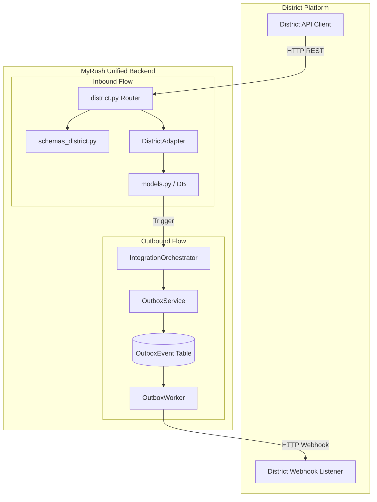

# District Integration - Implementation & Architecture

This document details the technical architecture and implementation of the District integration within the MyRush unified backend.

## 1. System Overview

The District integration is a bi-directional system that allows the District platform to discovery MyRush facilities, check real-time availability, and make/cancel bookings. It also ensures that any inventory changes within MyRush are synchronized back to District via webhooks.

---

## 2. Architecture Diagram

---

## 3. Inbound Architecture (District to MyRush)

District interacts with MyRush through a set of RESTful endpoints.

### Key Components
- **Router (`district.py`)**: Handles FastAPI routing, dependency injection (Database, Auth), and logging of integration requests.
- **Schemas (`schemas_district.py`)**: Pydantic models that enforce District's specific request/response formats.
- **Adapter (`DistrictAdapter`)**: The "Brain" of the integration. It translates District's data structures (e.g., 30-min slots) into MyRush's internal logic.
- **Idempotency**: Uses an `IdempotencyKey` table to ensure that retried `makeBatchBooking` requests do not create duplicate bookings.
- **Concurrency Control**: Uses **Pessimistic Locking** (`with_for_update()`) on court records during the booking process to prevent double-booking during high-concurrency periods.

---

## 4. Outbound Architecture (Transactional Outbox)

To ensure high reliability and "at-least-once" delivery of inventory updates to District, MyRush uses the **Transactional Outbox Pattern**.

### Workflow
1. **Trigger**: When a court is booked or a schedule changes, the `IntegrationOrchestrator` is called.
2. **Persistence**: Instead of sending a webhook immediately (which could fail), the `OutboxService` writes a payload into the `OutboxEvent` table within the same database transaction as the booking.
3. **Delivery**: A background process, `OutboxWorker`, polls the table for pending events.
4. **Reliability**: If a webhook fails, the worker uses **Exponential Backoff** (5m, 15m, 1h, etc.) to retry the delivery until successful or max attempts are reached.

---

## 5. Data Mapping & Translation

### Slot Logic
- **District**: Uses 30-minute intervals indexed from 0 to 47 (e.g., 0 = 00:00, 20 = 10:00).
- **MyRush**: Uses 1-hour slots internally but supports 30-minute granularity for integrations.
- **Translation**: The `DistrictAdapter` maps these indices to MyRush `time_slots` and enforces a **1-hour minimum booking** (minimum 2 District slots).

### Identity Mapping
- **Venue**: Mapped via `facilityName` (District) -> `Branch.name` (MyRush).
- **Sport**: Mapped via `sportName` (District) -> `GameType.name` (MyRush).

---

## 6. Security

- **Inbound Auth**: District requests must include a `Partner ID` and `API Key`. These are validated against the `Partner` table.
- **Webhook Security**: Outbound webhooks include an `API-KEY` and `Authorization` header (Basic Auth) as required by District specifications, configured via environment variables.

---

## 7. Key Files

| Module | Purpose |
| :--- | :--- |
| `routers/integrations/district.py` | API Endpoints & Auth |
| `services/integrations/district_adapter.py` | Translation & Booking Logic |
| `schemas_district.py` | Request/Response Data Models |
| `services/integrations/orchestrator.py` | Outbound Event Trigger |
| `services/integrations/outbox_worker.py` | Background Webhook Service |
